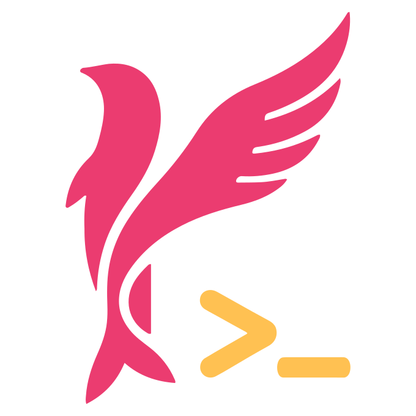

# Kun（鲲）Lang



> 北冥有鱼，其名为鲲。鲲之大，不知其几千里也。化而为鸟，其名为鹏。

Kun（鲲）（读音 `/kuːn/`）是一款函数式、强静态类型、代数数据类型、结构化 + 不可变数据、表达式导向语法、高性能的 Linux 脚本语言。支持以函数形式调用任意 Linux 命令，提供强大的命令编程和组合能力，从根本上消除 Shell 脚本所存在的各种问题。

## 核心特性

- **函数式命令调用**：将每个 Linux 命令抽象为具有确定签名的函数值，参数和输出均类型驱动
- **强静态类型系统**：支持代数数据类型（ADT）、模式匹配、泛型、类型推断
- **不可变数据结构**：所有数据默认不可变，消除突变带来的副作用
- **表达式导向语法**：借鉴 Elm、Haskell 和 Rust，简洁统一一致
- **安全与沙箱**：最小权限原则与能力安全（Capability-Based Security），基于 Linux namespace 的轻量级沙箱
- **严格求值管道**：内置管道机制与高阶函数，默认严格求值，let 绑定与 Stream 惰性
- **高性能运行时**：采用 Zig 作为宿主语言构建单体、无库依赖的轻量级二进制执行器

## 项目结构

```
kun-lang/
├── docs/        # 项目文档（VitePress）
├── code/        # 源代码
├── tools/       # 构建脚本
├── README.md    # 项目自述
└── LICENSE      # Apache 2.0 许可协议
```

## 许可证

本项目采用 [Apache 2.0](LICENSE) 许可协议。

## 文档

项目文档使用 VitePress 构建，可通过 [tools/docs-build.sh](tools/docs-build.sh) 构建，通过 [tools/docs-dev.sh](tools/docs-dev.sh) 本地预览。LSP 服务端通过 [tools/lsp-dev.sh](tools/lsp-dev.sh) 构建。
